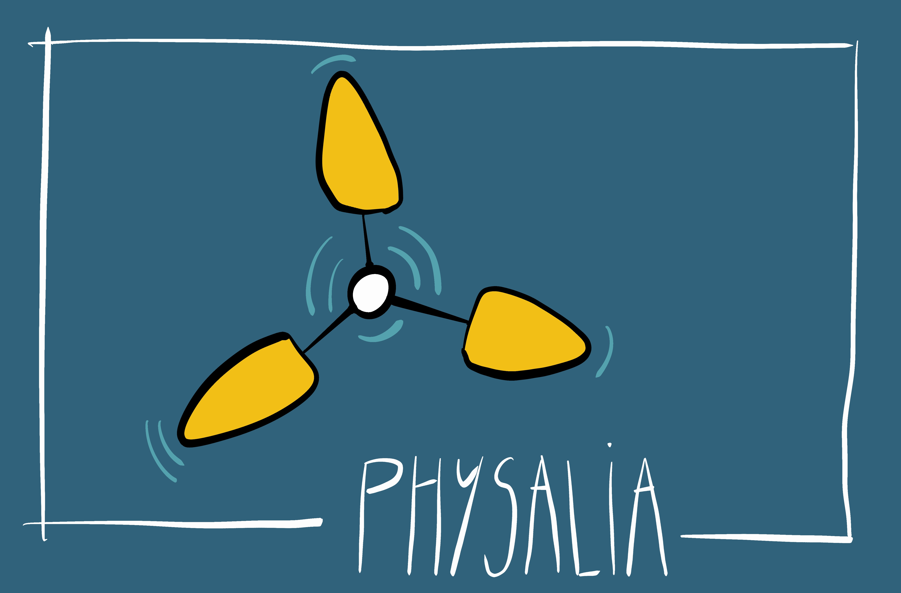
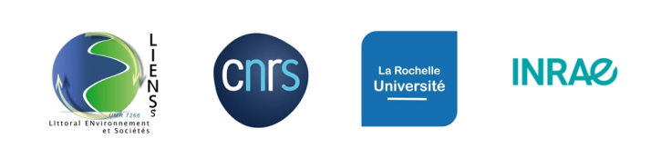
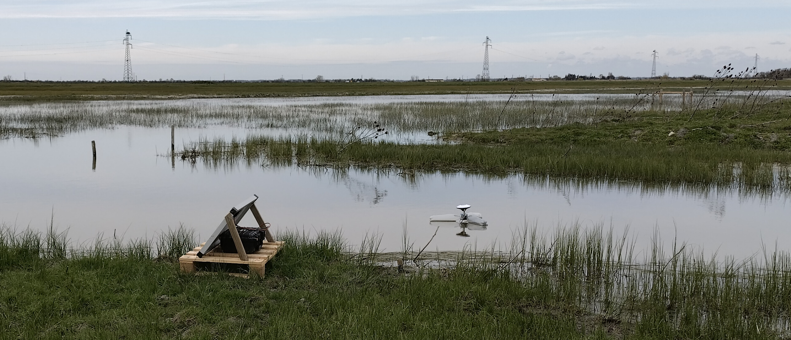
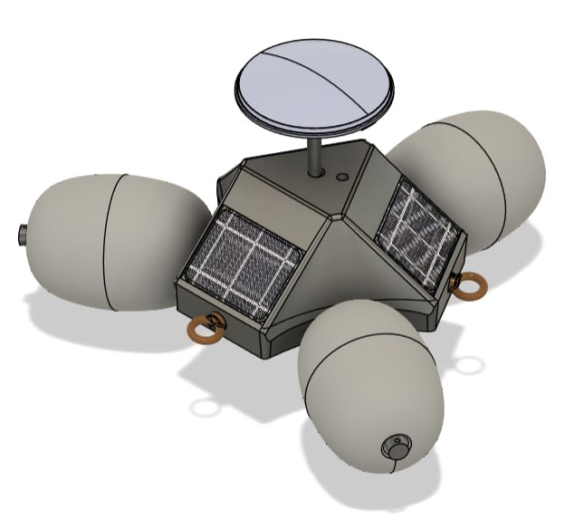

# PHYSALIA

## Plateforme HYdrographique pour la Surveillance Altimétrique du LIttoral

La surveillance du niveau de la mer et des niveaux hydrauliques des marais est un enjeu majeur dans la compréhension des dynamiques côtières et hydrologiques. Plusieurs études ont montré l’efficacité des bouées GNSS appliquées à la mesure du niveau de la mer. Toutefois, leur usage est généralement limité par le coût élevé d’un tel dispositif.

Plusieurs prototypes de bouées GNSS-RTK ont été développés afin de répondre à des problématiques liées à la surveillance en temps réel des variations du niveau de la mer et des marais littoraux. La réalisation des bouées est caractérisée par un besoin de réduction importante des coûts pour les rendre accessibles à tous.
Les bouées ont été construites autour d’une structure centrale et sont équipées de trois flotteurs montés sur des bras en acier inoxydable. La réception des signaux GNSS est assurée par un récepteur tri-fréquences qui utilise les constellations GPS, GLONASS, Galileo et Beidou. Les corrections RTK sont obtenues par le réseau [CentipedeRTK](https://centipede-rtk.org/). La réception des correction et le transfert des données produites est assurée par une connexion LTE.

## Objectifs

L’objectif et de suivre en continue avec une précision centimétrique les niveaux d’eau sur différents sites expérimentaux en marais doux atlantiques.

-------------------------------------------------------
# Versions

## Physalia V1 maritime

## Physalita hydro Marais

## Physalia V2 en développement

