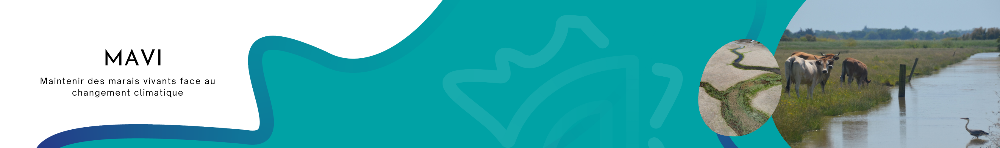
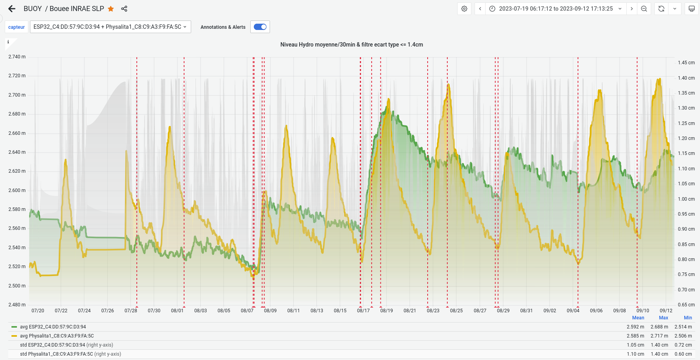
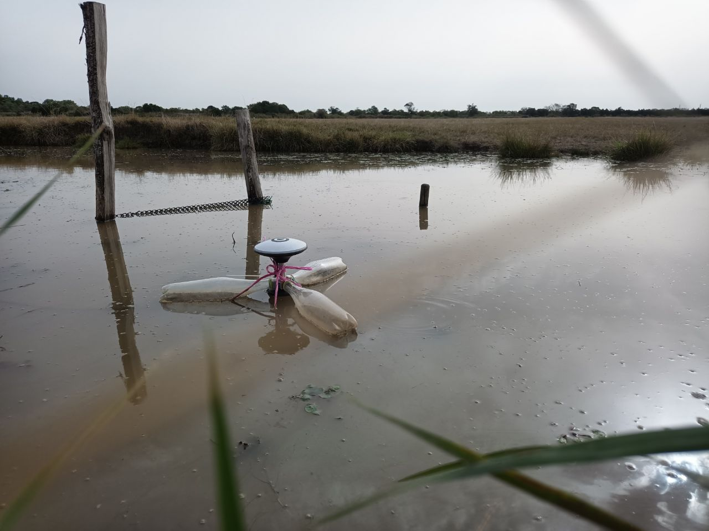

> https://www.tetrae.fr/

# Projet MAVI

> https://www.tetrae.fr/les-projets/mavi

## Contexte

Le premier volet de recherche a pour but de comprendre les interactions entre la biodiversité et la séquestration du carbone sous l’effet des pratiques de gestion de l’eau dans les marais. Différents suivis seront menés sur un réseau de sites expérimentaux afin de récolter de nombreuses données sur des thématiques liés à la biodiversité, au carbone et à la gestion de l’eau.

## Objectifs

L’objectif et de suivre en continue avec une précision centimétrique les niveaux d’eau sur différents sites expérimentaux en marais doux atlantiques.

## Hypothèse

Les différentes gestions hydrauliques du marais présentent des courbes de niveaux différentes, en fonction de leur réalimentation ou non et peuvent avoir des impacts plus ou moins importants sur la biodiversité et la séquestration du carbone.

## Indicateurs

* Hauteur des niveaux d’eau en NGF avec précision centimétrique
* Réalimentation dans les casiers hydrauliques
* Hauteur et fréquence des marnages

