Assembalge
==========

- Assemblage en groupes de composants
- Assemblage des goupes de composants

Outils nécéssaires
------------------

- Tournevis curciforme
- Tournevis héxagonal pour vis 8mm
- Cutter
- Fer à souder + bobine d'étain
- Support à bras pour soudure
- Perceuse + forets jusqu'à 15mm

Aperçu de la valise complète
----------------------------

Microcontrôleur ESP32 et Drotek DP0601
--------------------------------------

### Matériel & Outils

|**Matériel**||**Outils**|
|------------||----------|
|Carte ESP32-WROOM-32||Cutter|
|Drotek DP0601||Fer à souder|
|Nappe silicone JST-GH 6 pins||Etain|
|Routeur 4G ZTE||Support à bras pour soudure|
|Support à bras pour soudure||Câble USB Type-A vers USB Micro-B|

### Assemblage

- Récupérer le plan des entrées/sorties de la carte ESP32  
  **Attention, il varie en fonction du constructeur !**
- Page 4 de la [documentation](https://raw.githubusercontent.com/drotek/datasheets/master/DrotekDoc_0891B08A%20-%20DP0601%20GNSS%20RTK%20(F9P).pdf) du DP0601, récupérer le plan des entrées/sorties du port UART1
- Couper 3/4 d'une nappe JST-GH
- Connecter la prise JST-GH de la portion de nappe au port UART1 du DP0601 pour faciliter l'identification des fils à souder
- Séparer les brins correspondant au 5V, GND, B4 et B5 du port UART1 du DP0601
- Dénuder à l'ongle les extrémités séparées
 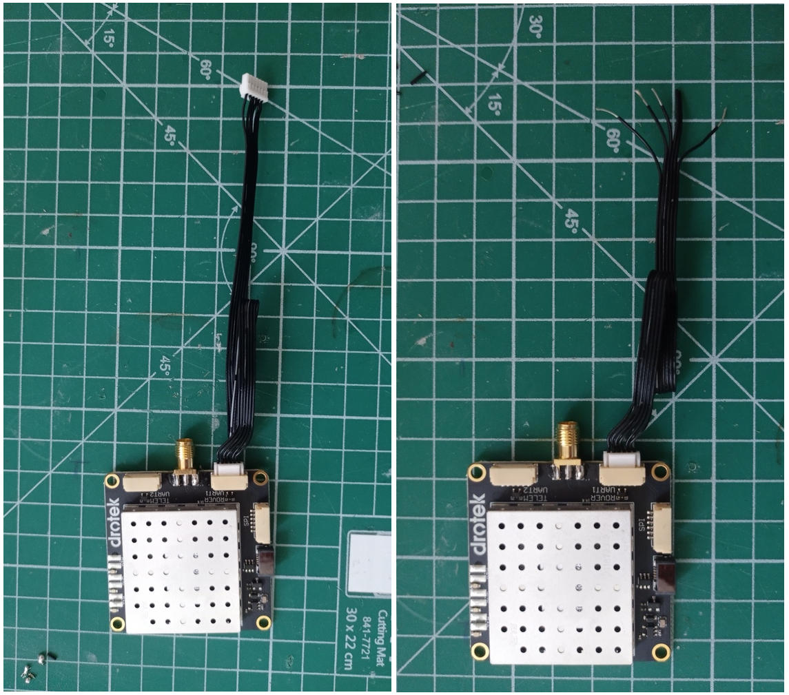
- Fixer l'ESP32 sur le support à souder 
  Le dos de la carte doit être au dessus
- Soudures :
	+ Pour cahque fil :
		* De l'avant vers le dos de la carte, passer la partie dénudée du fil à travers les trou de la pin à souder
		* Crocheter la partie dénudée du fil autour du bord de la carte pour le maintenir en place
		* Avec le fer à souder, chauffer l'anneau en metal de la pin et le fil dénudé le traversant
		* Faire fondre une petite quantité d'étain de manière à combler le trou des deux côtés
		* Couper l'éxédant de fil dénudé dépassant du dos de la carte électronique
	+ Souder le 5V au 5V de la carte ESP32
	+ Souder le GND au GND de la carte ESP32
	+ Souder la pin B4 à la pin SCL de la carte ESP32	
	+ Souder la pin B5 à la pin SD0 de la carte ESP32
- Couper court les deux fils intutiles de la nappe JST-GH
 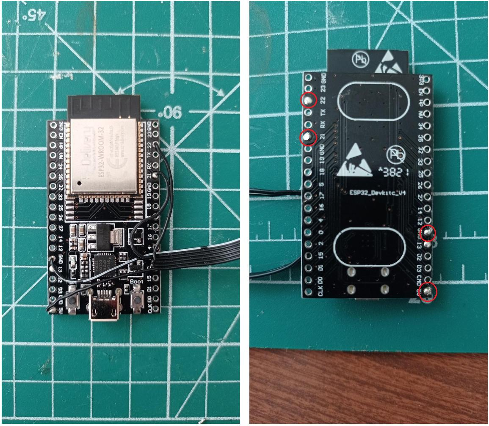

### Test de fonctionnement

- Connecter l'ESP32 en USB à l'ordinateur
- Sélectionner le port série associé à l'ESP32
 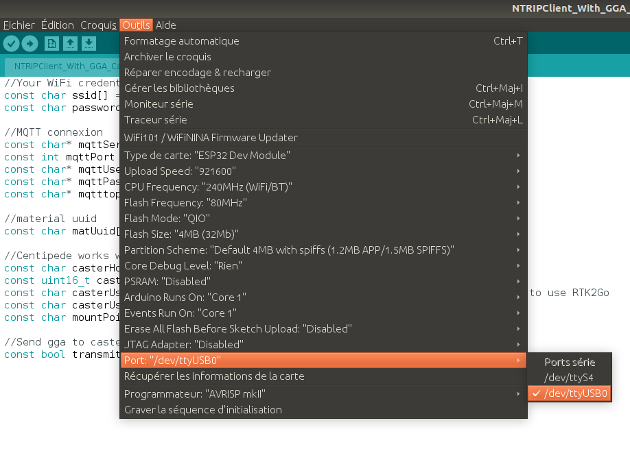
- Ouvrir le moniteur série dans l'IDE Arduino
 
- Mettre sous tension le routeur 4G
- Attendre que le voyant du point d'accès du routeur s'allume
 
- S'assurer dans le moniteur série que l'ESP32 se connecte au point d'accès WiFi du routeur, et détecte le DP0601
 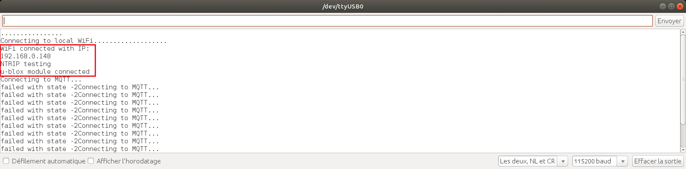

Valise étanche
--------------

### Matériel & Outils

|**Matériel**||**Outils**|
|------------||----------|
|12cm de câble électrique rouge||Fer à souder|
|12cm de câble électrique noir||Support à bras pour soudure|
|Cosses à oeil x2||Bobine d'étain|
|||Scotch isolant électrique|
|||Pince à dénuder|
|||Pince universelle|
|||
|Valise étanche et ses blocs de mousse de remplissage||Perceuse|
|Presse étoupe filetage M15 + joint x3||Forets jusqu'à 15mm|
|Batterie au plomb 20Ah avec boulon de câblage||Cutter|
||||
|Contrôleur de charge solaire||Tournevis cruciforme|
|Plaque rigide (min 34x29,5cm)||Cutter|
||||
|Vis héxagonale 8mm x4||Tournevis héxagonal pour vis 8mm|
||||
|Câble d'antenne||Crayon de papier de 10cm minimum|

### Préparation des câbles de la batterie

- Faire chauffer le fer à souder
- Dénuder les deux extrémités des câbles rouge et noir
- Sur chaque câble, souder une cosse à oeil :
	+ Passer le câble à travers le tube de la cosse, jusqu'à ce qu'il dépasse de quelques millimètres sur celle-ci 
	Si besoin, couper quelques fils de cuivre pour permettre au câble de passer le tube
	+ Pincer l'extrémité du tube de la cosse afin de bloquer le câble à l'intérieur
	+ Souder la partie de câble dépassant sur la cosse
	 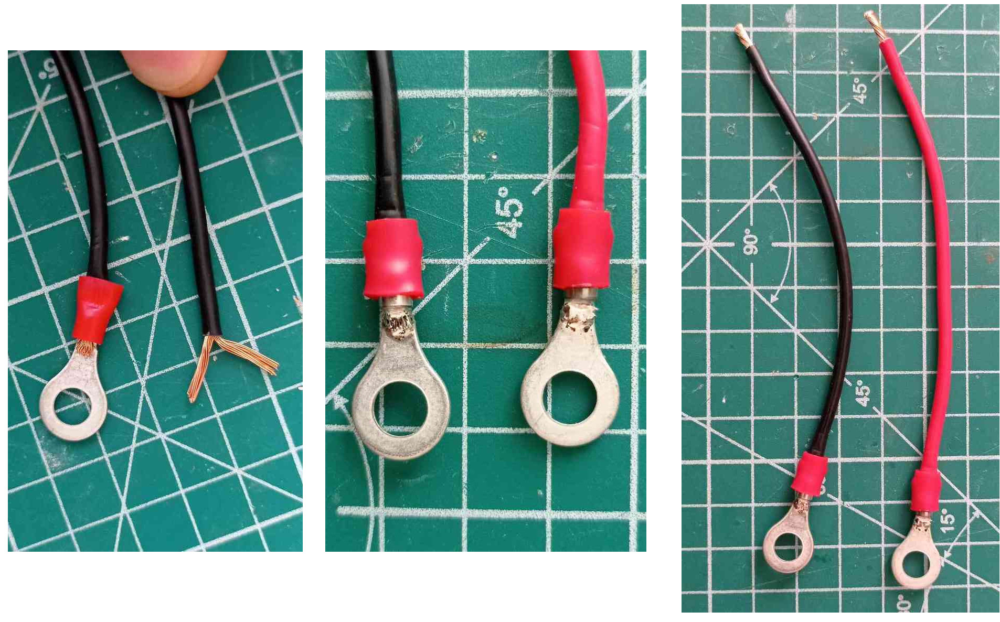
- Protéger les extrémités non serties des câbles avec du scotch isolant électrique
- Connecter les cosses sur les bornes de la batterie en utilisant les boulons prévus à cet effet

### Assemblage

#### Passage des câbles externes

- Vider totalement la valise
- Percer 3 trous de diamètre 15mm come suit, à travers la facade droite de la valise
- Visser les 3 presse étoupes avec leur joint dans les trous percés
 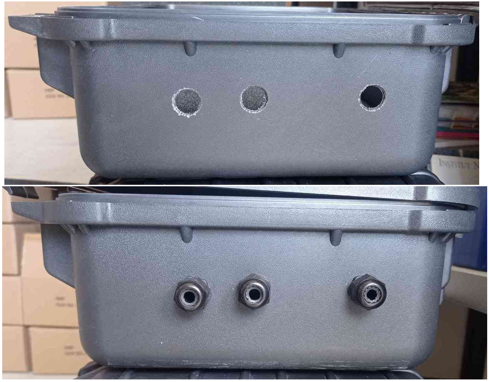

#### Installation et maintien de la batterie

- Placer le gros bloc de mousse à l'intérieur de la valise
- **Attention, la mousse peut être conductrice !** 
  Ne pas mettre les bornes de la batterie en contact avec la mousse
- A travers le centre du bloc de mousse, découper un rectangle de la même taille que la batterie 
  Le cadrillage prédécoupé permet de centrer facilement le rectangle et facilite la découpe
- Du côté des presse étoupes, sur une demi hauteur, couper la mousse autour des bornes afin d'éviter tout court-circuit
- Placer la batterie à l'intérieur du rectangle découpé 
  Ses bornes doivent être directement accessibles
 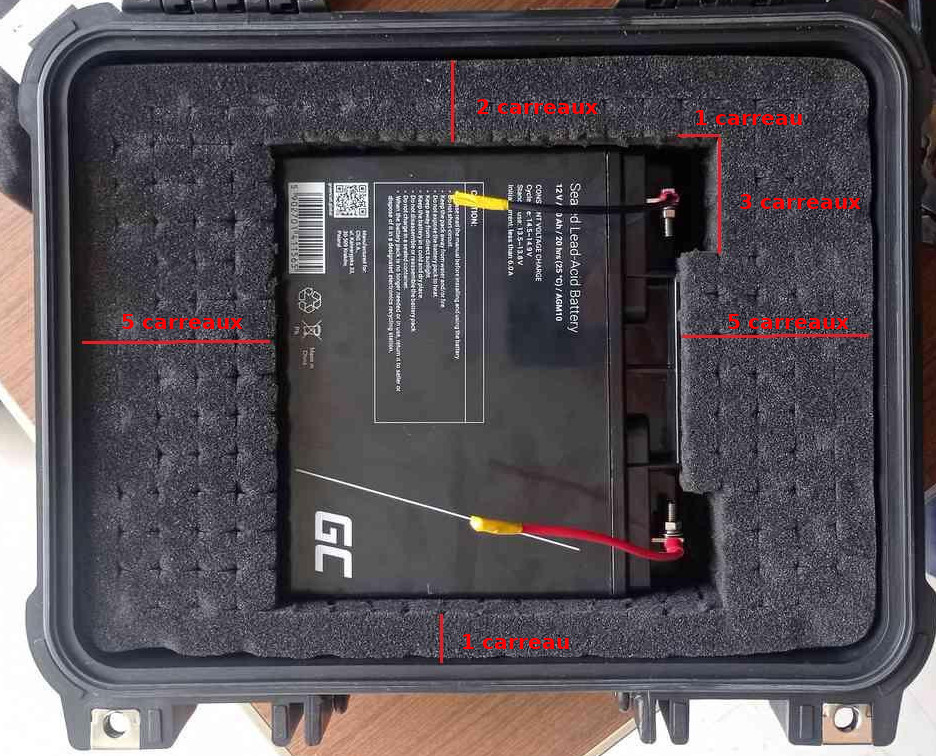

#### Installation du contrôleur de charge et isolation de l'alimentation

- Couper une plaque rigide aux dimensions de l'intérieur de la valise
- Au centre de la plaque, couper un rectangle aux dimensions de la face supérieure du contrôleur de charge
- Couper deux bandes de 3M Dual Lock de 2,5cm de longueur
- Coller une bande au centre de la face arrière du contrôleur de charge
- Fixer la seconde bande sur la 1ère et en retirer l'antiadhésif
- Passer le contrôleur de charge à travers le rectangle de la plaque
- En la tenant par le contrôleur de charge, apposer la plaque sur le bloc de mousse, afin de fixer le contrôleur de charge au bon endroit sur la batterie
 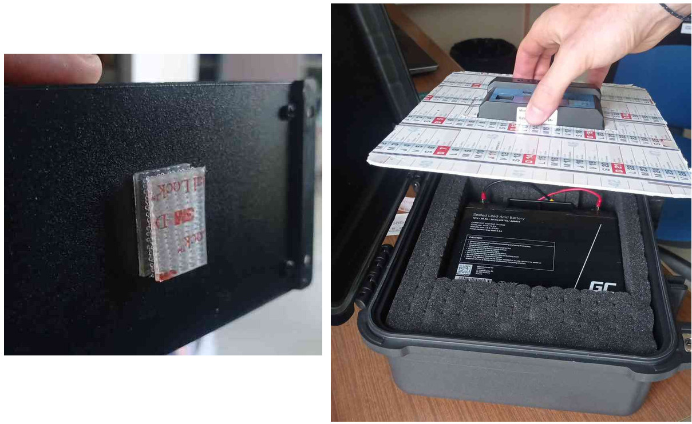
- Presser doucement le contrôleur de charge sur la batterie pour faire prendre l'adhésif
- Retirer la plaque et câbler la batterie au contrôleur de charge
- Visser 4 vis héxagonales de 8mm dans les supports situés dans les 4 coins de la face intérieure du couvercle de la valise
 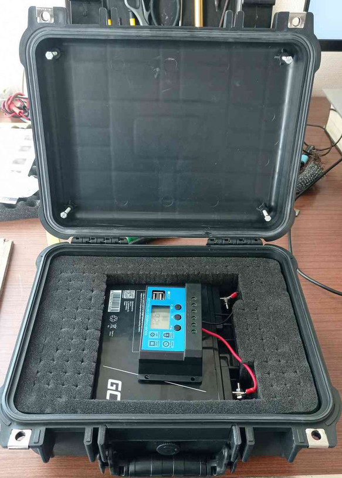
- Replacer la plaque
- Ajuster le serrage des vis de manière à maintenir la plaque en place lorsque la valise est fermée

#### Passage des câbles internes

- Retirer la plaque de la valise
- A travers les presse étoupes, prépercer la parroi du bloc de mousse au crayon de papier
- A l'aide du cardiallage prédécoupé, réaliser l'achemeinement des câbles du panneau solaire aux bornes du contrôleur de charge
- De la même manière, réaliser l'acheminement du câble d'antenne vers la face arrière de la valise
 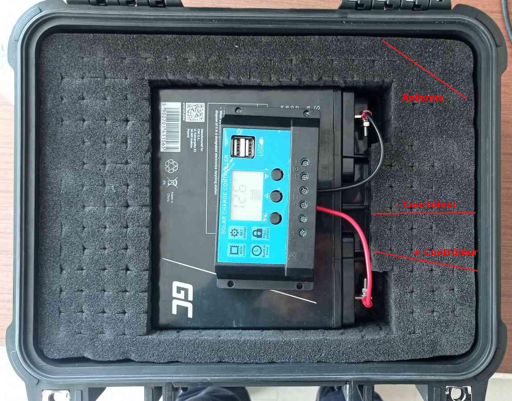
- Dimensionner les trous dans la parroi de mousse en y faisant passer le câble d'antenne 
  **Ne pas plier le câble d'antenne !**
- Tester le passage des câbles avec le câble d'antenne 
  Si besoin, modeler la mousse pour faire passer les câbles 
  Le câble d'antenne doit conserver une courbure naturelle à la sortie de son trou, et ne pas passer sur le contrôler de charge losque la valise est fermée
- Découper un morceau du bord de la plaque pour laisser passer le câble d'antenne
- Replacer la plaque

#### Fixation des composants électroniques

- Sur le dos de l'ESP32 et du DP0601, coller une bande de 0,5cm de 3M Dual Lock et y fixer son complémentaire
- Sur le dos du routeur 4G, coller deux bandes de 0,5cm de 3M Dual Lock proches des extrémités, et y fixer leur complémentaire
 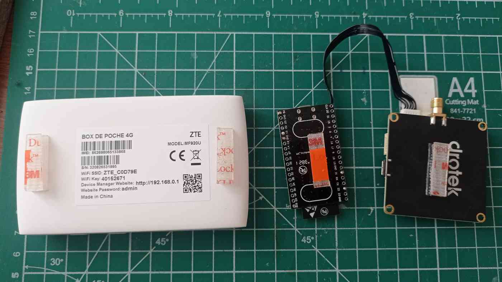
- Sur la face interne du couvercle, coller les compasants comme suit
 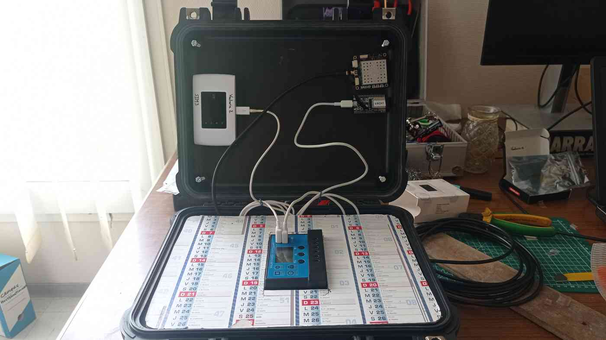

Antenne GNSS flotante
---------------------

### Matériel & Outils

|**Matériel**||**Outils**|
|------------||----------|
|Pièce imprimée en 3D||Chatterton|
|Colle néoprène||Gants jetables|
|3 bouteilles de soda|||
||||
|Antenne GNSS|||
|Pied d'antenne|||
|Vis à bois Xmm||Tournevis|

### Préparation du support à bouteilles

- Retirer les bouchons des bouteilles
- Enfiler les gants jetables
- Badigeonner de colle néoprène les emplacements des bouchons sur le support à bouteilles
- Enduire l'extérieur des bouchons de colle néoprène 
  **Ne pas les placer tout de suite sur le support**
- Attendre que la colle prenne (généralement 15min)
- Presser les bouchons dans leur emplacement
- Enrubaner le tout avec du Chatterton, de manière à presser les bouchons dans leur emplacement
- Attendre que la colle soit sèche (généralement 24h)
 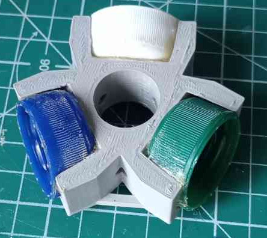

### Assemblage

- Assembler le pied d'antenne
- Enfiler à fond le support à bouteilles sur le pied 
  Attention au sens, la plus grande surface du support doit être au dessus
- Visser l'antenne à l'extrémité libre du pied
- Visser une vis à bois dans les petits trous du support pour le bloquer en translation
- Visser les bouteilles dans leur bouchon
 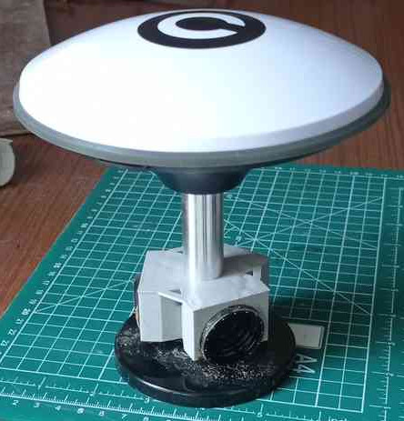