Configuration logicielle
========================

### Matériel

- Ordinateur
- Câble USB Type-A vers USB Micro-B

Dépôt GitHub
------------

Un dépôt Git du projet est diponible sur [GitHub](https://github.com/jancelin/physalia). Pour poursuivre ce tutoriel d'assemblage, il est nécéssaire de cloner ce dépôt, afin d'avoir tous les fichiers de configuration sour la main.

### Depuis GitHub

- Rendez-vous sur le dépôt [GitHub](https://github.com/jancelin/physalia) du projet
- Télécharger l'archive du dépôt 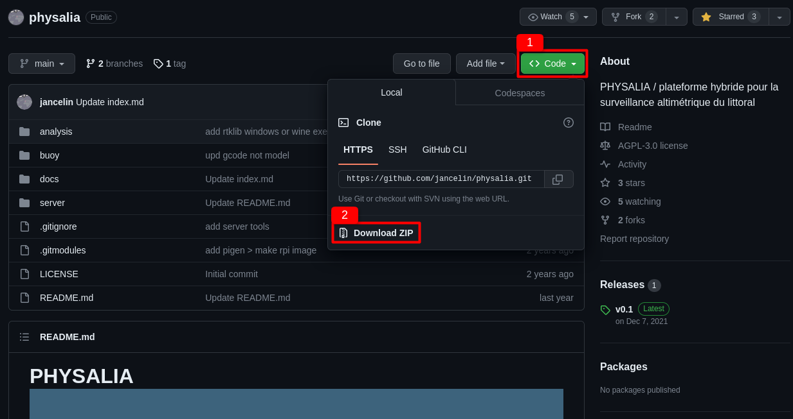
- Décompresser l'archive sur le bureau

### En ligne de commande

- Télécharger le logiciel Git
- Ouvrir un terminal de commande sur le bureau
- Exécuter la commande `git clone https://github.com/jancelin/physalia`

Au terme de cette étape le répertoire `physalia` devrait être présent sur votre bureau, peu importe la méthode suivie. Celui-ci contient tous les fichiers nécéssaire besoin pour la configuration logicielle des bouées.

Configuration du récepteur GNSS Drotek DP0601
------------------------------

### Matériel

- Ordinateur + connexion internet
- Drotek DP0601
- Câble USB Type-A vers USB Micro-B

### Logiciel

- Installer [u-center](https://www.u-blox.com/en/product/u-center) (pas u-center 2!)
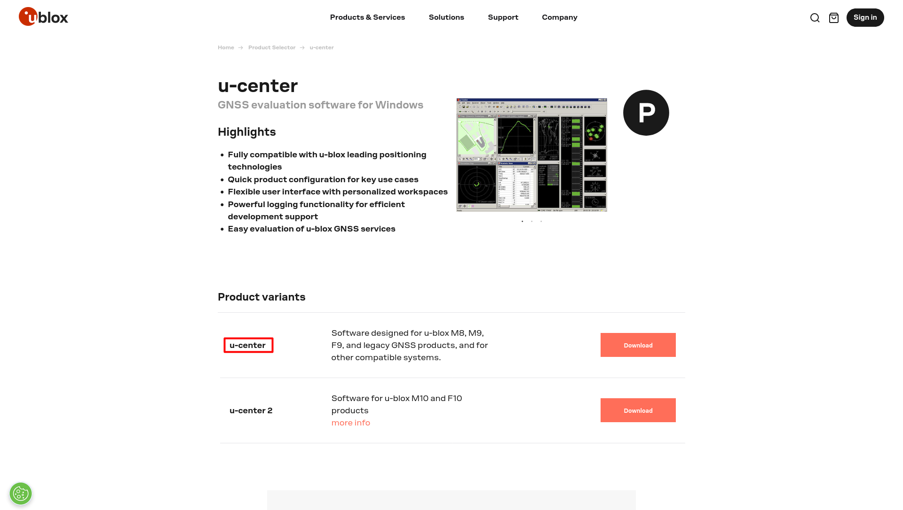

### Mise à jour du firmware

- Télécharger la version v1.32 du [firmware](https://content.u-blox.com/sites/default/files/2022-05/UBX_F9_100_HPG132.df73486d99374142f3aabf79b7178f48.bin)
- Téléverser le nouveau firmware au Drotek DP0601
	- Brancher le DP0601 en USB à l'ordinateur
	- Ouvrir u-center
	- Connecter u-center au port COM du DP0601
	 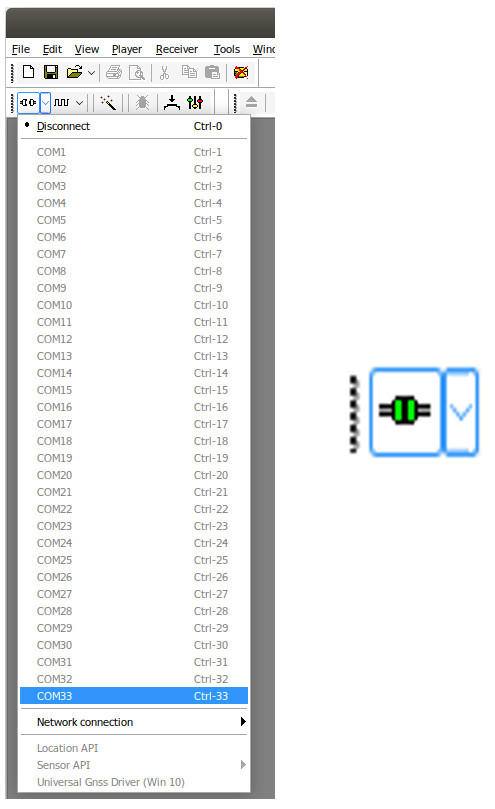
	- Aller dans `Tools` -> `Firmware update`
	- Dans `Firmware`, sélectionner le fichier firmware téléchargé
	- Cocher et configurer `Use this baudrate for updtate` à 9600 bauds
	- Décoher toutes les autres cases
	- Cliquer sur `GO`
	 
	- Déconnecter u-center du port COM
	 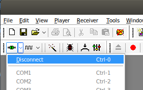
	- Débrancher le DP0601

#### Téléverser le fichier de configuration

- Brancher le DP0601 en USB à l'ordinateur
- Ouvrir u-center
- Connecter u-center au port COM du DP0601
 
- Aller dans `Tools` -> `Receiver Configuration`
- Dans `Configuration file`, sélectionner le fichier de configuration situé dans le dossier `physalia/buoy_mavi/f9p/F9P_1_13_rover_rtcm3_gga_PVT_uart1-115200b_1hz_sbasoff_pedestrian_15deg.txt` du dépôt ou le télecharger [ici](https://github.com/jancelin/physalia/blob/low_energy/buoy_mavi/f9p/F9P_1_13_rover_rtcm3_gga_PVT_uart1-115200b_1hz_sbasoff_pedestrian_15deg.txt)
- Cliquer sur `transfer file -> GNSS`
 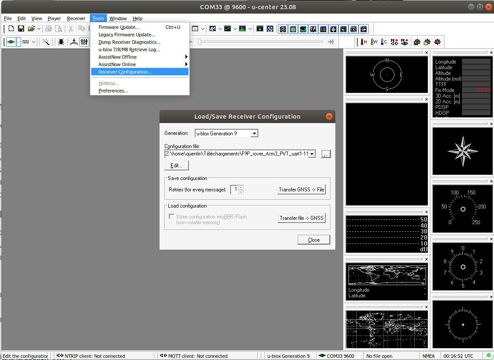
- **Ne pas débrancher le DP0601 !** Il reste encore à sauvegarder sa configuration

[comment]: <- Dans la section `Load configuration`, cocher la case check the box to save config into Flash instead of RAM>

#### Sauvegarder la configuration

- Ouvrir u-center
- Aller dans `View` -> `Configuration View`
 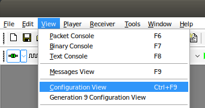
- Dans la secion `CFG` : 
	+ Selectionner `Save current configuration` 
	+ Selectionner `0 - BBR` et `1 - FLASH` en utilisant `Ctrl+Maj`
	+ Cliquer sur `Send` pour sauvgarder la configuration
	 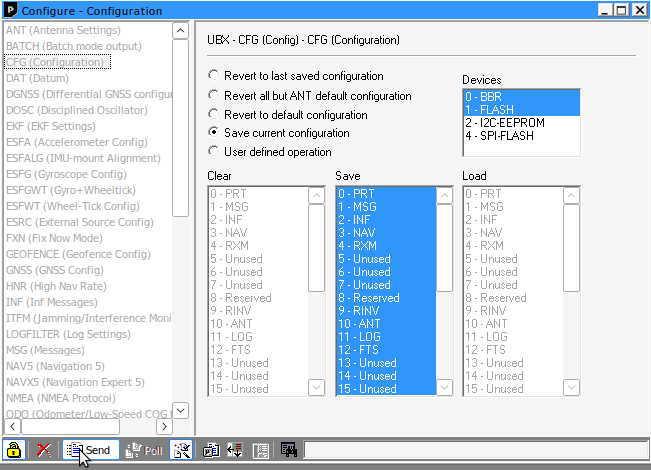
- Déconnecter et débrancher le DP0601

Configuration du microcontrôleur ESP32
--------------------------------------

### Matériel

- Ordinateur + connexion internet
- Carte électronique ESP32-WROOM-32
- Câble USB Type-A vers USB Micro-B

### Configuration

- Installer et ouvrir l'[IDE Arduino](https://www.arduino.cc/en/software)
- Modifier dans `Fichier > Préférences > Localisation` du croquis le chemin vers le dossier `physalia/buoy_mavi/esp32`
- Ouvrir le fichier `buoy_mavi/esp32/buoy_sim7600_rtk/buoy_sim7600_rtk.ino` dans l'éditeur Arduino 
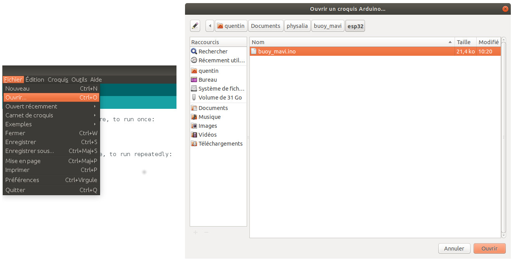

- Editer le fichier `secret.h` : 
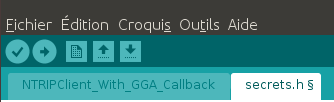
	+ Si besoin, modifier les informations du serveur MQTT
	+ Configurer l'identifiant unique de la bouée 
      **Attention** il doit commencer et finir par par un `'`
	+ Si besoin, modifier les informations du caster NTRIP pour changer de base de référence

- Téléverser le programme sur l'ESP32 :
	+ Installer le support logiciel de carte requis :
		* Aller dans `Outils` -> `Type de carte` -> `Gestionnaire de carte`
		* Taper `ESP32` dans la bar de recherche
		* Installer le paquet `esp32` fourni par Espressif Systems
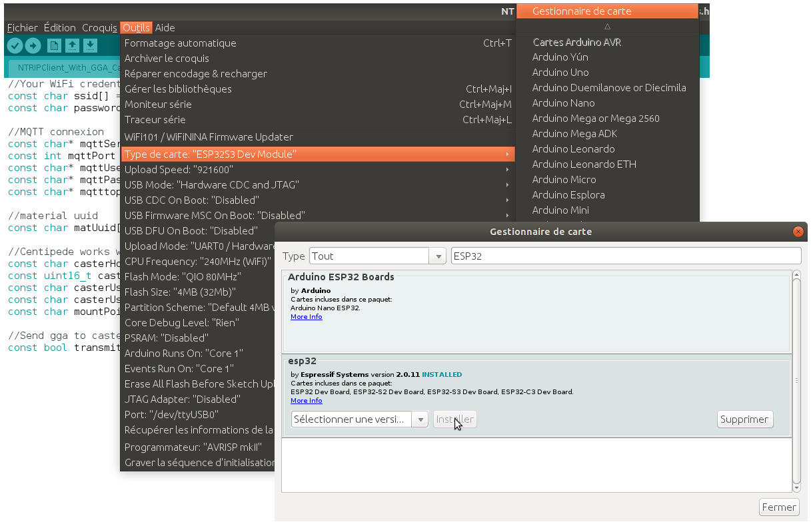
	* Aller dans `Outils` -> `Type de carte` -> `ESP32 Arduino` et selectionner `ESP32 Dev Module`
	* Aller dans `Outils` -> `Port` et sélectionner le port correspondant à l'ESP32 (le seul normalement) 
 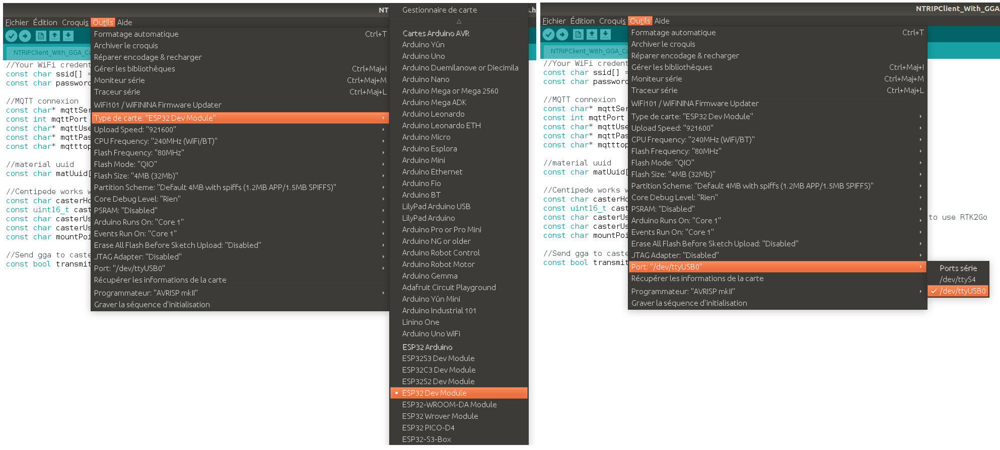
	+ Téléverser le programme sur l'ESP32
 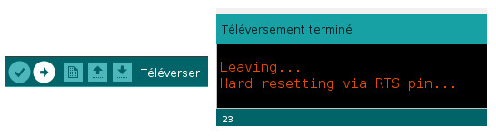
- Débrancher l'ESP32

Assemblage
----------
Féliciations, vous avez terminé la configuration logicielle de la bouée. 
Rendez-vous sur le [tutoriel d'assemblage](assembly.md) pour la suite des hostilités.
