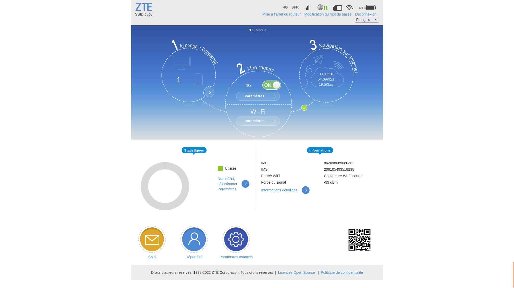
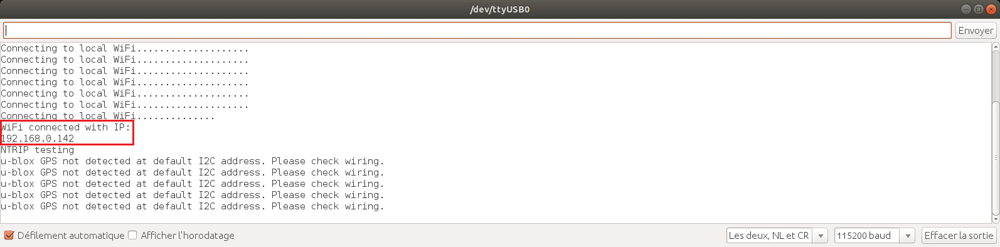
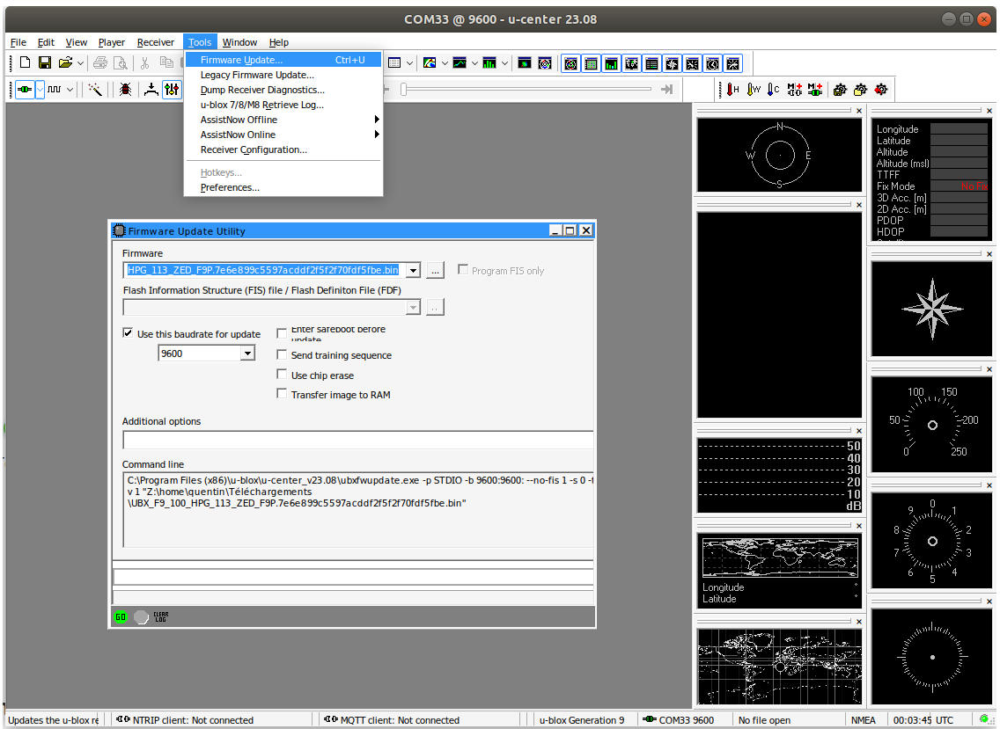

Configuration logicielle
========================

Configuration du routeur 4G
---------------------------

### Matériel

- Ordinateur
- Routeur 4G ZTE MF920U
- Câble USB Type-A vers USB Micro-B

### Configuration

- Insérer la carte SIM dans le routeur
- Brancher le routeur sur une source d'alimentation
- Mettre le routeur sous tension
- Attendre que voyant du point d'accès WiFi du routeur soit allumé
 
- Connecter l'ordinateur au point d'accès WiFi en utilisant les identifiants au dos du routeur
 
- Accéder à l'interface web du routeur :
	+ Ouvrir un navigateur internet
	+ Dans la barre d'adresse, entrer l'URL `http://192.168.0.1` pour accéder à l'interface web du routeur
- Entrer le mot de passe `admin` renseigné au dos du routeur et cliquer sur `Connexion`
 
- Dévérrouiller la carte SIM en entrant son code PIN, et cocher `Save PIN code`
 
- Attendre la fin des éventuelles mises à jour et redémarrage du routeur 
  Se reconnecter au point d'accès WiFi du routeur
- Rafraîchir la page web

[comment]: <- Basculer le bouton 4G sur `OFF`>
 

- Aller dans `Paramètres avancés`
	+ Paramétrer l'`Economie d'énergie` :
		* Dans `Portée Wi-Fi`, sélectionner `Portée Wi-Fi courte`
		* Appliquer les changements pour cette section
		* Dans `Temps de veille`, sélectionner `Veille désactivée`
		* Appliquer les changements pour cette section
		 

	+ Dans `Autres` -> `Code PIN`, s'assurer que `Enregistrer le code PIN` est coché

- De retour sur la page d'accueil, configurer les `Paramètres` du Wi-Fi :
	+ Changer le `Nom du réseau (SSID)` pour `buoy`
	+ Changer le mot de passe pour `Buoy_43210!`
	+ Limiter le `Nombre de connexions maximum` à 2
	+ Appliquer les changements
	+ Accepter la déconnexion de périphériques du point d'accès WiFi
	 

[comment]: <- Se reconnecter au point d'accès avec les nouveaux identifiants renseignés
	- De retour sur la page d'accueil, basculer le bouton 4G sur `ON`>
 
- Se déconnecter de la page
	 
- S'assurer que `buoy` appparait dans les réseaux WiFi disponibles
- Mettre le routeur hors tension
- Laisser le routeur charger complètement

Dépôt GitHub
------------

Un dépôt Git du projet est diponible sur [GitHub](https://github.com/jancelin/physalia). Pour poursuivre ce tutoriel d'assemblage, il est nécéssaire de cloner ce dépôt, afin d'avoir tous les fichiers de configuration sour la main.

### Depuis GitHub

- Rendez-vous sur le dépôt [GitHub](https://github.com/jancelin/physalia) du projet
- Télécharger l'archive du dépôt 
- Décompresser l'archive sur le bureau

### En ligne de commande

- Télécharger le logiciel Git
- Ouvrir un terminal de commande sur le bureau
- Exécuter la commande `git clone https://github.com/jancelin/physalia`

Au terme de cette étape le répertoire `physalia` devrait être présent sur votre bureau, peu importe la méthode suivie. Celui-ci contient tous les fichiers nécéssaire besoin pour la configuration logicielle des bouées.

Configuration du microcontrôleur ESP32
--------------------------------------

### Matériel

- Ordinateur + connexion internet
- Carte électronique ESP32-WROOM-32
- Câble USB Type-A vers USB Micro-B

### Configuration

- Installer et ouvrir l'[IDE Arduino](https://www.arduino.cc/en/software)
- Ouvrir le fichier `buoy_mavi/esp32/esp32.ino` dans l'éditeur Arduino 

- Editer le fichier `secret.h` : 

	+ Laisser les identifiants WiFi par défaut : 
		`ssid = "buoy"` 
		`password = "Buoy_43210!"`
	+ Si besoin, modifier les informations du serveur MQTT
	+ Configurer l'identifiant unique de la bouée 
      **Attention** il doit commencer par un `'` et terminer par un `_`
	+ Si besoin, modifier les informations du caster NTRIP

- Téléverser le programme sur l'ESP32 :
	+ Installer le support logiciel de carte requis :
		* Aller dans `Outils` -> `Type de carte` -> `Gestionnaire de carte`
		* Taper `ESP32` dans la bar de recherche
		* Installer le paquet `esp32` fourni par Espressif Systems

	* Aller dans `Outils` -> `Type de carte` -> `ESP32 Arduino` et selectionner `ESP32 Dev Module`
	* Aller dans `Outils` -> `Port` et sélectionner le port correspondant à l'ESP32 (le seul normalement) 
 
	+ Téléverser le programme sur l'ESP32
 
- Débrancher l'ESP32

[comment]: <+ Télécharger les bibliothèques requises à la compilation du code source :
				* Aller dans `Croquis` -- `Inclure une bibliothèque` -- `Gérer les bibliothèques`	* Chercher et installer la bibliothèque `SparkFun u-blox GNSS Arduino Library` développée par Sparkfun Electronics
				* Chercher et installer la bibliothèque `ArduinoJson` développée par Benoit Blanchon
				* Chercher et installer la bibliothèque `PubSubClient` développée par Nick O'Leary>

### Test de connexion au routeur 4G

- Sur l'ordinateur, brancher en USB l'ESP32 configuré
- Lancer l'IDE Arduino
- Sélectionner la carte `ESP32 Dev Module` et le port série de l'ESP32

- Ouvrir le moniteur série en haut à droite de l'éditeur
  
  Sa sortie devrait être similaire à la figure ci-contre

- Mettre le routeur 4G configuré sous tension
- Une fois l'ESP32 connecté au routeur, la sorite du moniteur série confirme la connexion

Configuration du Drotek DP0601
------------------------------

### Matériel

- Ordinateur + connexion internet
- Drotek DP0601
- Câble USB Type-A vers USB Micro-B

### Mise à jour du firmware

- Télécharger la version v1.13 du [firmware](https://www.u-blox.com/en/product/zed-f9p-module?file_category=Firmware%2520Update)

- Installer [u-center](https://www.u-blox.com/en/product/u-center) (pas u-center 2!)

- Téléverser le nouveau firmware au Drotek DP0601
	- Brancher le DP0601 en USB à l'ordinateur
	- Ouvrir u-center
	- Connecter u-center au port COM du DP0601
	 
	- Aller dans `Tools` -> `Firmware update`
	- Dans `Firmware`, sélectionner le fichier firmware téléchargé
	- Cocher et configurer `Use this baudrate for updtate` à 9600 bauds
	- Décoher toutes les autres cases
	- Cliquer sur `GO`
	 
	- Déconnecter u-center du port COM
	 
	- Débrancher le DP0601

### Configuration
#### Téléverser le fichier de configuration

- Brancher le DP0601 en USB à l'ordinateur
- Ouvrir u-center
- Connecter u-center au port COM du DP0601
 
- Aller dans `Tools` -> `Receiver Configuration`
- Dans `Configuration file`, sélectionner le fichier de configuration situé dans le dossier `buoy_mavi/f9p/` du dépôt
- Cliquer sur `transfer file -> GNSS`
 
- **Ne pas débrancher le DP0601 !** Il reste encore à sauvegarder sa configuration

[comment]: <- Dans la section `Load configuration`, cocher la case check the box to save config into Flash instead of RAM>

#### Sauvegarder la configuration

- Ouvrir u-center
- Aller dans `View` -> `Configuration View`
 
- Dans la section `MSG` :
	+ Chercher `01-07 NAV-PVT` du champs `Message`
	+ S'assurer que les cases `UART1` et `USB` sont cochées
	 
- Dans la section `RATE` :
	+ S'assurer que `Time source` est configuré sur `1 - GPS`
	+ S'assurer que `Measurement Frequency` est configuré à 1Hz
	 
- Dans la section `PRT` :
	+ S'assurer que pour la cilbe `1 - UART1`, les protocoles in/out et le baudrate sont configurés à `0+1+5 - UBX+NMEA+RTCM3`, `0+1 - UBX-NMEA` et 115200 bauds
- Dans la section `PRT` : 
	+ S'assurer que pour la cible `3 - USB`, les protocoles in/out et le baudrate sont configurés à `0+1+5 - UBX+NMEA+RTCM3`, `0+1 - UBX-NMEA`  et 115200 bauds
	 
- Dans la secion `CFG` : 
	+ Selectionner `Save current configuration` 
	+ Selectionner `0 - BBR` et `1 - FLASH` en utilisant `Ctrl+Maj`
	+ Cliquer sur `Send` pour sauvgarder la configuration
	 

Assemblage
----------
Féléiciations, vous avez terminé la configuration logicielle de la bouée. 
Rendez-vous sur le [tutoriel d'assemblage](assembly.md) pour la suite des hostilités.