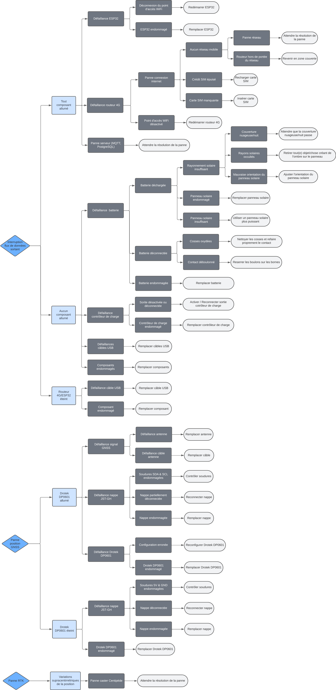

Dépannage
=========

Les pannes identifiées du système ont été séparées en deux catégories :

- Les pannes au démarrage
- Les pannes en fonctionnement

La procédure de dépannage à adopter est déterminée par les arbres des causes suivants.

**Attention, il existe de nombreux modes défaillance possibles du système, ce pourquoi ce document n'est pas exhaustif. Il est donc possible que la panne que vous rencontrez n'y soit pas répertoriée. Le cas échéant, merci d'en faire part à votre administrateur.**

Arbes des causes
-------------------

### Lecture

Les arbres des causes présentés permettent d'identifier les causes probables d'une panne, et les actions à mettre en oeuvre pour la résoudre. Ils sont contitués d'une origine (extrémité gauche de l'arbe, en couleur); et de branches, débutant par un noeud (intersection entre deux branches), et terminant soit par un autre noeud, soit par une feuille (extrémité droite de l'arbre). Chaque arbre concerne une panne particulière.

Ils présentent deux sens de lecture complémentaires :

- <ins>De gauche à droite :</ins> 
  Ce sens de lecture part de l'origine, jusqu'à l'identification de la cause précise  de la panne et sa solution. 
  La panne est formulée à l'origine colorée de l'arbre. Lui susccèdent, en couleur claire, d'éventuels constats permettant d'orienter la recherche de cause. Viennent ensuite les causes, en couleur sombre, et de plus en pus précises qu'elles progressent vers les feuilles de l'arbre. Finalement, les feuilles proposent une solution qui permettrait de résoudre la panne.

- <ins>De haut en bas :</ins> 
  Les constats et causes ont été organisés par probabilité d'apparition. Pour celles ou ceux issus d'un même noeud, les plus probables se situent en haut, et les moins probables en bas.

### Utilisation

1. Trouver l'arbre correspondant à la panne (origine de l'arbre).
2. Identifier le constat correspondant à la situation (couleur claire).
3. Pour ce constat, éliminer les causes en les parcourant de la plus à la moins probable.
4. A la première cause non éliminée, appliquer la solution correspondante.
5. Si la panne n'est pas résolue, continuer de parcourir l'arbre en éliminant les causes.

### Exemple d'utilisation

<ins>Panne :</ins> Interruption du flux de données sortant de la bouée

<ins>Etat du système :</ins> 

- Aucun des composants électroniques n'est allumé.
- Le contrôleur de charge est opérationnel et indique que la batterie est chargée.

<ins>Dépannage :</ins>

1. L'arbre correspondant est le premier des "*Pannes en fonctionnement*".
2. Le constat "*Aucun composant allumé*" correspond à la situation.
3. La branche "*Défaillance batterie*" peut être éliminée car :
	- Le contrôleur de charge indique que la batterie n'est pas déchargée.
	- L'état de charge de la batterie sur le contrôleur de charge montre qu'elle y est bien connectée.
	- La batterie ne semble pas endommagée. 
  Dans la branche "*Défaillance contrôleur de charge*" :
	- Le voyant de sortie de contrôleur de charge est éteint, sa sortie n'est pas active.
4. L'activation de la sortie du contrôleur de charge solutionne le problème.
5. Panne résolue.

Astuces de dépannage
--------------------

- <ins>Astuce n°1 :</ins> Debug via moniteur série 
  Il est possible de monitorer l'état du système pendant son fonctionnement en analysant les messages envoyés par l'ESP32 dans la sortie du moniteur série Arduino.
- <ins>Astuce n°2 :</ins> Connexion au routeur 4G 
  Si le routeur 4G a bien été confiuré, son point d'accès WiFi admet jusqu'à deux appareils connectés en simultané. Ceci signifie qu'il est possible d'y connecter un smartphone ou un PC pour s'assurer, à travers l'interface web de gestion du router, que l'ESP32 est bien connecté au point d'accès.

Pannes au démarrage
-------------------

Cette section concerne uniquement les pannes survenues juste après la mise sous tension du système.

Pannes en fonctionnement
------------------------

Dans cette section, on supposera que le système fonctionnait avant la panne. Si le système est tombé en panne juste après sa mise sous tension, se référer aux "*Pannes au démarrage*".

